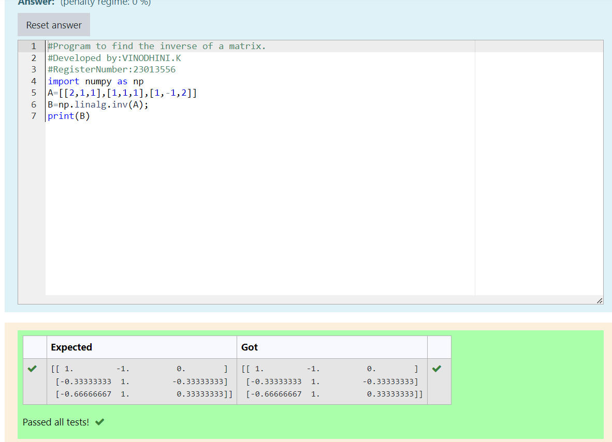

# INVERSE-OF-A-MATRIX
## Aim:
To write a python program to find the inverse of a matrix
## Equipment’s required:
1. 	Hardware – PCs
2. 	Anaconda – Python 3.7 Installation / Moodle-Code Runner
## Algorithm:
### Step1 : 
 Import NumPy
### Step 2: 
Define the Matrix A
### Step 3: 
Find the Inverse of the Matrix
### Step 4: 
Output the Result

## Program:
``````
import numpy as np
A=[[2,1,1],[1,1,1],[1,-1,2]]
B=np.linalg.inv(A);
print(B)
``````
## Output:

## Result:
Thus the inverse of given matrix is successfully solved using python program

